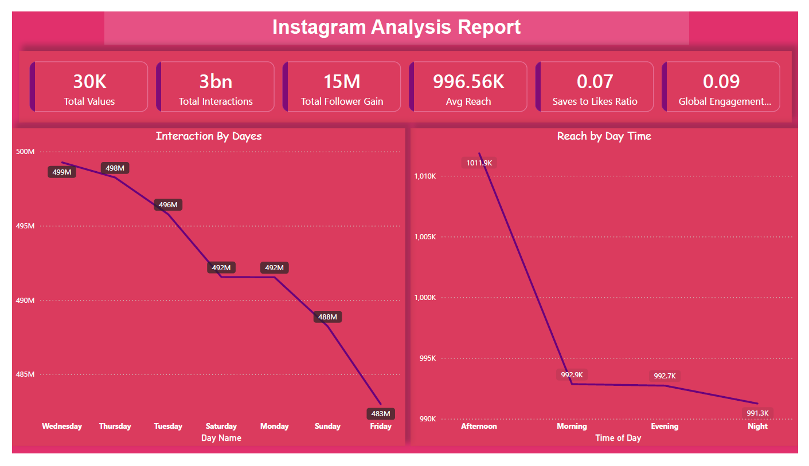
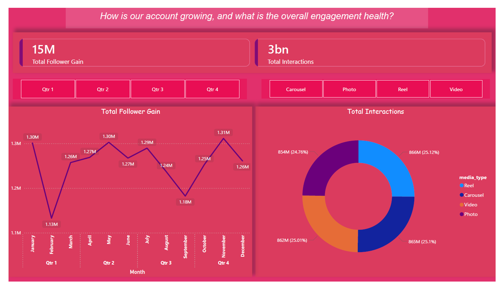
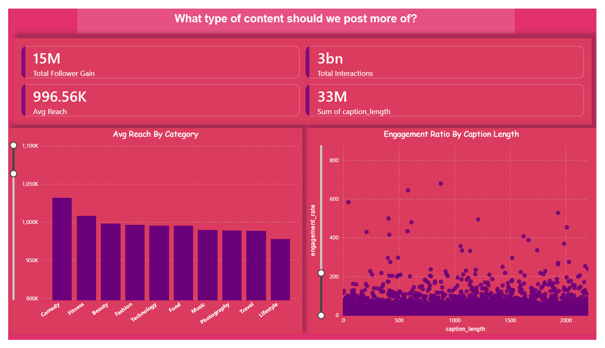
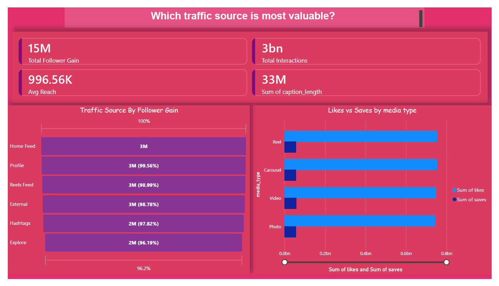

# Instagram-Analytics-Dashboard
📸 Power BI dashboard analyzing 30K Instagram posts. Insights on 3B interactions, 15M follower gain, optimal posting times, and content strategy recommendations.


# 📸 Instagram Analytics Dashboard

## 📊 Project Overview
This project presents a comprehensive **Instagram Analytics Dashboard** built using **Power BI Desktop**. The dashboard analyzes Instagram post performance, audience engagement patterns, content effectiveness, and growth metrics to help optimize social media strategy and maximize reach.

## 🎯 Problem Statement
Understanding Instagram performance is crucial for social media success. This analysis aims to uncover:
- Account growth patterns and engagement health
- Optimal content types and posting strategies
- Best performing traffic sources
- Content characteristics that drive engagement
- Timing and format preferences of the audience

## 📈 Dashboard Preview





## 🔍 Key Business Questions Answered

1. **How is our account growing, and what is the overall engagement health?**
2. **What type of content should we post more of?**
3. **Which traffic source is most valuable?**
4. **When is the best time to post for maximum reach?**
5. **What caption length drives the most engagement?**
6. **Which content categories perform best?**

## 📊 Key Insights

### Overall Performance Metrics
- **Total Interactions**: 3 billion
- **Total Follower Gain**: 15 million
- **Average Reach**: 996.56K per post
- **Saves to Likes Ratio**: 0.07
- **Global Engagement Rate**: 0.09 (9%)
- **Total Posts Analyzed**: 30K

### Media Type Performance
1. **Reel** - 866M interactions (25.12%) - **TOP PERFORMER**
2. **Carousel** - 865M interactions (25.1%)
3. **Video** - 862M interactions (25.01%)
4. **Photo** - 854M interactions (24.76%)

### Best Days to Post
Top performing days by interaction:
1. **Wednesday** - 499M interactions
2. **Saturday** - 496M interactions
3. **Thursday** - 492M interactions
4. **Friday** - 492M interactions
5. **Tuesday** - 488M interactions

### Optimal Posting Times
Reach by time of day:
1. **Afternoon** - 1,011.9K reach (12 PM - 5 PM) 🏆
2. **Night** - 992.9K reach (9 PM - 12 AM)
3. **Evening** - 992.7K reach (5 PM - 9 PM)
4. **Morning** - 991.3K reach (12 AM - 12 PM)

### Monthly Growth Trends
- **Q2** shows highest follower gain (June: 1.30M, May: 1.30M)
- **Consistent growth** across all quarters
- **Q4** slightly lower performance (November: 1.24M)
- **Peak months**: March (1.31M), June (1.30M), May (1.30M)

### Top Content Categories by Reach
1. **Lifestyle** - 1,050K+ average reach
2. **Travel** - 1,025K+ average reach
3. **Photography** - 1,000K+ average reach
4. **Music** - 975K+ average reach
5. **Food** - 950K+ average reach

### Most Valuable Traffic Sources
Ranked by follower gain:
1. **Home Feed** - 3M followers (99.56%) - **Most effective**
2. **Profile** - 3M followers (98.99%)
3. **Reels Feed** - 3M followers (98.78%)
4. **External** - 2M followers (97.82%)
5. **Hashtags** - 2M followers (96.19%)
6. **Explore** - Data available

### Caption Length Analysis
- **Sweet spot**: 50-150 characters (Medium captions)
- Engagement rate peaks around 400-600 character range
- Very long captions (>1500 chars) show diminishing returns
- Short captions (<50 chars) perform moderately well

### Content Engagement Patterns
- **Reels** generate highest saves and likes
- **Carousels** show strong engagement consistency
- **Videos** maintain competitive interaction rates
- **Photos** still relevant but lowest in interactions

## 🛠️ Tools & Technologies Used
- **Power BI Desktop** - Dashboard creation and visualization
- **DAX (Data Analysis Expressions)** - Custom measures and calculations
- **Power Query** - Data transformation and cleaning
- **CSV Data Import** - Raw data processing
- **Kaggle** - Data source

## 📁 Project Structure
```
Instagram-Analytics-Dashboard/
│
├── 📂 dashboards/
│   └── Instagram_Analytics.pbix           # Main Power BI dashboard
│
├── 📂 data/
│   └── Instagram_Analytics.csv            # Raw Instagram data (30K posts)
│
├── 📂 documentation/
│   ├── Instagram_Analytics Report.pdf     # Analysis report
│   ├── instagram notes.txt                # Data transformation steps
│   └── instagram formulas notes.txt       # DAX formulas reference
│
├── 📂 screenshots/
│   ├── dashboard-page1.png                # Interactions & Reach analysis
│   ├── dashboard-page2.png                # Growth & Engagement health
│   ├── dashboard-page3.png                # Content type analysis
│   └── dashboard-page4.png                # Traffic source analysis
│
├── 📂 video/
|    ├─ video.MP4 video File               # Video of the Dashboard
|
└── 📖 README.md                           # Project documentation
```

## 🚀 How to Use

### 1. **Download the Repository**
```bash
git clone https://github.com/yourusername/Instagram-Analytics-Dashboard.git
```

### 2. **Open the Power BI File**
- Ensure you have **Power BI Desktop** installed ([Download here](https://powerbi.microsoft.com/desktop/))
- Navigate to `dashboards/` folder
- Open `Instagram_Analytics.pbix`

### 3. **Explore the Dashboard**
- Navigate through 4 comprehensive pages
- Use filters to analyze specific:
  - Time periods (Month, Quarter)
  - Media types (Reel, Carousel, Video, Photo)
  - Content categories
  - Traffic sources
- Hover over visuals for detailed tooltips
- Click on data points for cross-filtering

### 4. **Refresh Data (Optional)**
- If you have updated data:
  - Click **"Home"** → **"Refresh"**
  - Ensure CSV file path is correct
  - Power BI will reload all calculations

## 💡 Data Transformation Steps

### Power Query Transformations Applied:

1. **Downloaded data** from Kaggle
2. **Imported CSV** into Power BI
3. **Split upload_date column** into Date and Time
4. **Deleted unnecessary** time column
5. **Created index column** for table relationships
6. **Added random time** column using blank query
7. **Merged tables** using index column
8. **Expanded time** column into main table
9. **Cleaned up** by removing index column
10. **Applied changes** and closed Power Query

### Calculated Columns Created:

1. **Day Name** - Extracted from date column
```DAX
Day Name = FORMAT('Instagram_Analytics'[upload_date], "dddd")
```

2. **Time of Day** - Categorized posting times
```DAX
Time of Day = 
SWITCH(TRUE(),
    HOUR('Instagram_Analytics'[post Time]) < 12, "Morning",
    HOUR('Instagram_Analytics'[post Time]) < 17, "Afternoon",
    HOUR('Instagram_Analytics'[post Time]) < 21, "Evening",
    "Night"
)
```

3. **Caption Category** - Grouped by length
```DAX
Caption Category = 
SWITCH(TRUE(),
    'Instagram Analytics'[caption_length] < 50, "Short (<50)",
    'Instagram Analytics'[caption_length] <= 150, "Medium (50-150)",
    "Long (>150)"
)
```

4. **Is Viral** - Flagged high-performing posts
```DAX
Is Viral = IF('Instagram Analytics'[engagement_rate] > 10, "Viral", "Normal")
```

## 📐 DAX Measures Reference

### Core Performance Metrics:

1. **Total Interactions** (Sum of all engagement actions)
```DAX
Total Interactions = 
SUM('Instagram Analytics'[likes]) + 
SUM('Instagram Analytics'[comments]) + 
SUM('Instagram Analytics'[shares]) + 
SUM('Instagram Analytics'[saves])
```

2. **Average Reach per Post**
```DAX
Avg Reach = AVERAGE('Instagram Analytics'[reach])
```

3. **Global Engagement Rate** (Impressions-based)
```DAX
Global Engagement Rate = 
DIVIDE([Total Interactions], SUM('Instagram Analytics'[impressions]), 0)
```

4. **Saves to Likes Ratio** (Content value indicator)
```DAX
Saves to Likes Ratio = 
DIVIDE(SUM('Instagram Analytics'[saves]), SUM('Instagram Analytics'[likes]), 0)
```

5. **Follower Conversion Rate** (Post effectiveness)
```DAX
Follower Conv % = 
DIVIDE(SUM('Instagram Analytics'[followers_gained]), SUM('Instagram Analytics'[reach]), 0)
```

## 📌 Business Recommendations

### Content Strategy:
1. **Prioritize Reels** - Highest interaction rate (25.12%)
2. **Post on Wednesdays & Saturdays** - Peak engagement days
3. **Schedule posts in Afternoon** (12 PM - 5 PM) - Best reach window
4. **Focus on Lifestyle & Travel content** - Highest average reach
5. **Use medium-length captions** (50-150 characters) - Optimal engagement

### Growth Strategy:
1. **Leverage Home Feed** - Most effective for follower conversion (99.56%)
2. **Optimize profile** - Second-best traffic source (98.99%)
3. **Invest in Reels Feed presence** - Strong follower acquisition (98.78%)
4. **Create shareable content** - High saves-to-likes ratio indicates value

### Engagement Optimization:
1. **Maintain consistent posting** - All quarters show strong performance
2. **Diversify media types** - All formats perform competitively
3. **Test caption lengths** - Sweet spot around 400-600 characters
4. **Track viral posts** - Posts with >10% engagement rate

### Traffic Source Focus:
1. **Home Feed optimization** is crucial - Drives 99%+ follower gain
2. **Profile visits** convert well - Ensure strong bio and highlights
3. **Reels Feed** presence essential - Capitalize on Instagram's algorithm
4. **External traffic** opportunity - Share content across platforms

## 🎓 Key Learnings

### Technical Skills Demonstrated:
- Power BI dashboard design and development
- DAX measure creation and optimization
- Power Query data transformation
- Data modeling and relationships
- Time intelligence functions
- Interactive visualization design
- Business intelligence reporting

### Analytical Insights:
- Correlation between content type and engagement
- Temporal patterns in social media consumption
- Traffic source effectiveness analysis
- Content optimization strategies
- Audience behavior patterns

## 📊 Dataset Information

- **Source**: Kaggle
- **Total Records**: 29,999 Instagram posts
- **Time Period**: Full year analysis (2023)
- **Columns**: 15 attributes including:
  - Post metrics (likes, comments, shares, saves)
  - Reach and impressions data
  - Caption and hashtag information
  - Traffic source tracking
  - Engagement rates
  - Content categories

## 🔍 Dashboard Features

### Page 1: Interactions & Timing Analysis
- Interactions by day of week
- Reach by time of day
- Key performance indicators (KPIs)
- Daily and hourly patterns

### Page 2: Growth & Engagement Health
- Monthly follower gain trends
- Quarterly performance comparison
- Media type distribution
- Growth trajectory analysis

### Page 3: Content Performance
- Average reach by content category
- Engagement ratio by caption length
- Content type recommendations
- Category-wise breakdown

### Page 4: Traffic Source Analysis
- Follower gain by traffic source
- Likes vs saves by media type
- Source effectiveness comparison
- Conversion metrics

## 📧 Contact

For any questions or feedback regarding this project, please feel free to reach out!

**Your Name**
- GitHub: [@yourusername](https://github.com/lileshwar-mahajan)
- LinkedIn: [Your LinkedIn Profile](www.linkedin.com/in/lileshwar-mahajan-b81137255)
- Email: mahajanlileshwar@gmail.com

## ⭐ Acknowledgments

- Kaggle for providing the Instagram analytics dataset
- Power BI community for visualization best practices
- Social media analytics resources for industry insights


**If you find this project helpful, please consider giving it a ⭐ and sharing it with others!**

## 🔗 Related Projects

Check out my other data analysis projects:
- [Spotify Talent & Popularity Analysis](https://github.com/lileshwar-mahajan/Spotify-Data-Analysis)
- [FNP Sales Analysis](https://github.com/lileshwar-mahajan/FNP-Sales-Analysis)
- [Other Analytics Dashboards](link-to-portfolio)

---

*Last Updated: December 2024*

## 💬 Feedback & Contributions

Found a bug or have suggestions? Feel free to:
- Open an issue
- Submit a pull request
- Contact me directly

Your feedback helps improve this project! 🚀📸
